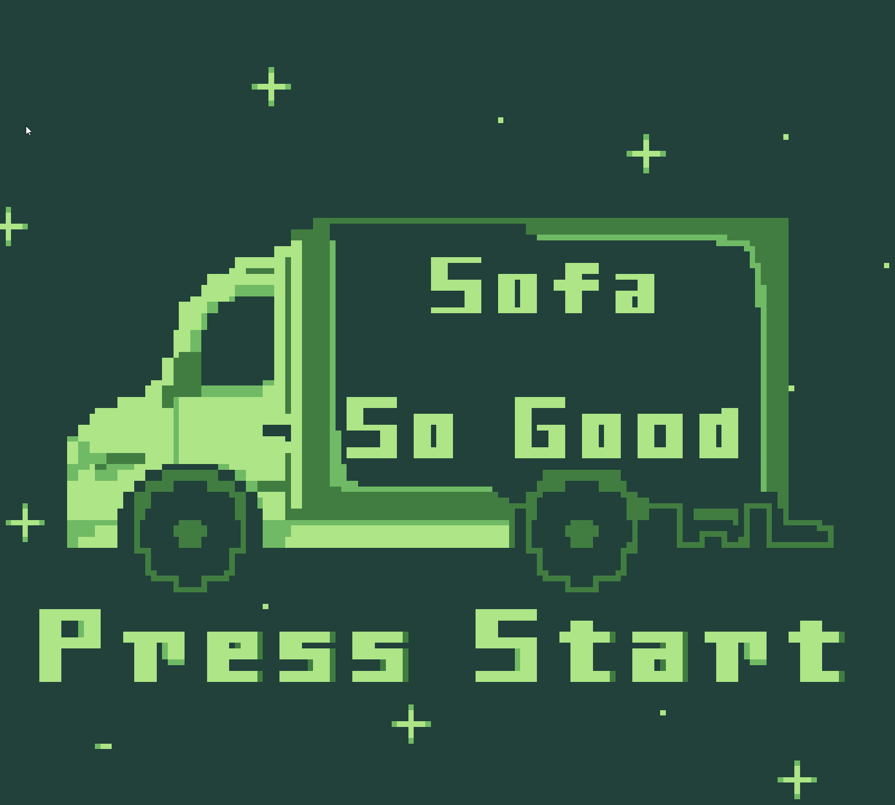

# GB 11 Game Jam Project

Rules and details of the game jam available [here](https://itch.io/jam/gbjam-11)

## How to run the project

1. Download the godot engine from [here](https://github.com/godotengine/godot/releases/download/4.1.1-stable/Godot_v4.1.1-stable_win64.exe.zip)
2. Extract the zip file to where you want the engine installed.
3. Run the godot executable `Godot_v4.1.1-stable_win64.exe`
4. Import this project into godot
5. Hit play

## Playing the game

A version of the game is hosted on the bananafacts website available here:

https://bananafacts.co.uk/gb11
